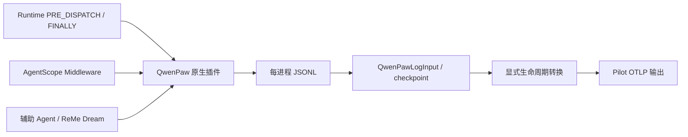

# QwenPaw Runtime 接入与 Python 探针对比

Pilot 原生插件支持 **QwenPaw 2.1.0 + AgentScope 2.0.4.post1**。对比基线是
AgentCore Runtime 使用的 LoongSuite Python QwenPaw、AgentScope、util-genai **0.9.0**。
插件检查实际安装版本，其他版本不会挂载采集；升级 QwenPaw 或 AgentScope 后需要重新验收。

## 接入结构



Runtime Hook 能获取请求、会话、Task、错误及请求终止，但不能提供完整的模型尝试、
token、首 token 时延和工具执行边界。需要同时使用 AgentScope Middleware 的
`on_reply`、`on_reasoning`、`on_model_call`、`on_acting`。

插件通过 builder 注册 Middleware，并可逆地给框架新建的 Agent 附加 Middleware，
覆盖 ReMe 内部辅助 Agent，避免重复挂载。Dream 定时任务没有前台请求，插件为其创建
独立后台 ENTRY，保留所属 Agent 身份。原生卸载会停用已创建 Agent 上的 Middleware，
并恢复仍由本插件持有的包装函数。

复用 Pilot 现有目录插件部署、Agent 发现、文件 checkpoint、归一化、内容开关、脱敏和
OTLP 输出。新增的显式生命周期转换器调用公开的 `@loongsuite/otel-util-genai` API，
保存真实父子层级，不从一轮消息推测模型调用或补造结束时间。

## 安装与 Runtime 配置

QwenPaw Python 环境不需要安装 LoongSuite Python instrumentation。Pilot 插件在
QwenPaw 进程内生成 JSONL，由单独的 Pilot 进程上报。每个 Sandbox/安装实例使用自己的
数据目录；插件写入进程和采集进程应具有读取该目录的权限。

```bash
export QWENPAW_WORKING_DIR=/absolute/path/to/qwenpaw-working
export LOONGSUITE_PILOT_DATA_DIR=/absolute/path/to/pilot-data
export AGENT_DATA_COLLECTION_CONFIG="$LOONGSUITE_PILOT_DATA_DIR/config.json"

# 在已安装 Pilot 的目录运行；适合镜像构建阶段，缺失部署能力时返回非零。
node /absolute/path/to/pilot/dist/index.js deploy --require qwenpaw --json

# 运行阶段启动采集进程，再通过 Runtime 的正常启动方式启动 QwenPaw。
node /absolute/path/to/pilot/dist/index.js
```

部署目标是 `$QWENPAW_WORKING_DIR/plugins/loongsuite-pilot`，默认
`~/.qwenpaw/plugins/loongsuite-pilot`。QwenPaw 启动时通过原生 PluginLoader 加载插件。
首次部署或更新后重启 QwenPaw；向运行中进程复制文件不等于已加载。无需调用会发生
目录自复制的 `qwenpaw plugin install --force`。

插件数据目录优先级为 `LOONGSUITE_PILOT_DATA_DIR`、部署 marker 中的 `dataDir`、
`~/.loongsuite-pilot`。运行隔离测试时必须显式设置第一个变量，不能只更换 HOME 后复用
另一个安装实例的插件路径。

最小配置示例（将接收地址及资源身份替换为 Runtime 实际配置）：

```json
{
  "collectTrace": true,
  "collectLog": true,
  "serviceName": "agentcore-qwenpaw",
  "agents": {
    "qwenpaw": { "enabled": true, "captureMessageContent": true }
  },
  "listeners": { "qwenpaw-log": { "enabled": true, "pollInterval": 1000 } },
  "otlpTrace": {
    "endpoint": "http://127.0.0.1:4318/v1/traces",
    "resourceAttributes": { "service.namespace": "actual-runtime-workspace" }
  }
}
```

接收端认证、CMS endpoint 和可信 Workspace/租户归属按现有 Runtime 配置注入。
`agentcore.*` Task/run 字段从当前 request_context 读取，默认透传到 span；不需要
Qoder CLI 的 UUID/调用上下文文件协议。`gen_ai.session.id` 和
`gen_ai.conversation.id` 保持业务会话，`gen_ai.turn.id` 使用请求 ID。
不要把 run UUID 当作 conversation，也不要从接收 endpoint 反推租户归属。

避免同时启用 Python QwenPaw/AgentScope instrumentation 和 Pilot 插件，否则会重复
采集同一调用。卸载及回滚只删除 managed marker 属于本数据目录的插件，保留用户目录、
其他安装实例的插件与符号链接。

## 已实现能力

| 能力 | 实现与验证 |
|---|---|
| ENTRY → AGENT → STEP → LLM / TOOL | 保存显式父子关系、实际时间和重试尝试；辅助 Agent 可挂在真实父节点下 |
| 多轮、并发 | session 与 run 分开；同 session 重叠请求不会提前关闭另一请求 |
| 消息 | 请求、最终回复、system instructions、工具调用与递归工具结果 |
| 模型与 token | 模型、provider、input/output/total、可得的 cache usage；不补造不存在的 usage |
| TTFT | 真实首次非空 streaming delta 的纳秒时延；非流式 LLM 不伪造 TTFT |
| 错误与取消 | 模型 404、工具错误、主动取消保留错误状态；子节点先关闭，ENTRY.end 最后写出 |
| Skill | 原生 Skill 工具的 name、workspace-scoped id、description、version |
| Dream | 后台 ENTRY、owner、真实内部 Agent/STEP/LLM/TOOL |
| 生命周期 | 每进程日志、完整行 checkpoint、重启不重放已消费记录、原生卸载停写 |
| 内容控制 | `agents.qwenpaw.captureMessageContent=false` 在源端去除内容；复用 Pilot 内容策略和脱敏 |

原始 JSONL 包含 prompt 和工具内容时，目录/文件分别使用 0700/0600；日志路径为
`$LOONGSUITE_PILOT_DATA_DIR/logs/qwenpaw/qwenpaw-YYYY-MM-DD-PID.jsonl`。
观测写入失败不改变业务结果。采集器复用现有 checkpoint 语义；未完成请求遇到进程强杀
不保证补齐所有 span，不能将重启去重表述为跨崩溃 exactly-once。

## 2026-09-20 验收记录

分支基于 Runtime 当前使用的 `08bcaa7fb286087a7b12c29ed2680c3485312a05`
（`fix/20260918_pilot_namespace_env`），保留原有 Qoder 能力。两个独立 Python 3.12
环境均通过 `uv pip check`，实际 ReMe 为 0.4.1.5。基线加载发布的 0.9.0 instrumentor；
Pilot 侧从 `npm run build`、`npm pack`、独立 `npm install` 产物部署原生插件。

两侧均使用真实 QwenPaw Runtime、官方 WorkspaceBootstrapFactory/WorkspaceRegistry、
真实 DashScope `qwen-plus`，无 mock 模型或工具结果。验收使用合成工作区输入。

| 场景 | 结果 |
|---|---|
| 文件工具、多轮、非流式、两会话并发、工具失败、模型 404、首输出后取消 | 前台双方各 38 spans；每会话层级和父边一致 |
| Dream | 双方均采集辅助 Agent、模型、工具；独立模型迭代不同，基线 17 spans，Pilot 25（含后台 ENTRY） |
| 独立 Skill | 双方各 7 spans；四个技能字段一致 |
| OTLP 实际接收 | 主矩阵基线 55 / Pilot 63 spans，独立 Skill 7 / 7；结构、字段、时间包含和错误校验全部通过 |
| Trace validator | 安装态主数据及 Skill 均 0 ERROR；有可选属性和未配置云资源相关 WARN，不等于全部推荐属性均存在 |
| 重启去重 | 采集器正常重启后主服务累计保持 70 个唯一 span，没有重放（主矩阵 63，加首次 Skill 补证 7） |
| 自动检查 | 83 项新增/相关 TS、validator、清理测试，22 项 Python 插件测试及 329 项相邻回归通过；typecheck/build 通过 |
| 独立审查 | 卸载停写、递归工具结果、STEP 时间问题修复后无未解决发现 |

测试接收器保留 HTTP body 和解码 OTLP JSON，支持 Node exporter 的 chunked 请求；
空 body 直接拒绝。该验收以接收端数据为准，不能只使用 SDK callback 成功或 debug 文件。
初期 receiver 和旧插件的失败尝试保留在本地证据目录，最终报告使用独立 accepted 数据。

可复现脚本、环境准备、真实矩阵及 wire 比较见
[E2E README](../../scripts/e2e/qwenpaw-parity/README.md)。
本次固定的规则快照见 `tests/fixtures/qwenpaw/trace-validation-rules.json`，原始来源是
仓库提交 `73c13d44af385b711a56314f4ceaab35b56a3706`，测试校验其 SHA256。
保留现有 `docs/trace-validation-rules.json` 生成文件约定；可用新生成规则另行校验。

```bash
npm run typecheck
npm run build
node scripts/validate-trace.mjs \
  --input /absolute/path/to/actual-otlp-debug.jsonl \
  --rules tests/fixtures/qwenpaw/trace-validation-rules.json \
  --format json --output /absolute/path/to/validation-report.json
```

## 扩大样本后的补充结论

后续又执行了三轮矩阵、两次 Dream、两次 Skill，以及六会话并发、连续三轮记忆、
一次读取三个文件和索引依赖读取。最终有效 A/B 样本每侧 39 次请求/后台任务，
Python 实际 OTLP 收到 232 spans，Pilot 收到 227 spans；双方均逐源核对完整，
差数来自独立模型的执行次数及 Dream 的 ENTRY 组织方式，未发现漏传或跨会话串链。

早期 Python 基线未开启 `OTEL_SEMCONV_STABILITY_OPT_IN=gen_ai_latest_experimental`，
虽有 `SPAN_AND_EVENT` 设置，仍未生成消息属性。早期证据可用于结构和 usage 比较，
不能用于证明内容对等。扩大验收修正启动设置后重跑所有基线，以新数据替代内容结论。

完整内容比对发现并修复了一个转换缺陷：归一化的结束记录含 `undefined`，覆盖了
开始记录中的系统提示词和工具定义。修复后重新构建、安装并重放同一批真实原始日志，
103 处 system instructions、58 处 tool definitions 全部恢复，逐条内容相同；
227 spans 校验为 0 ERROR。新增回归覆盖完整的 normalization → converter 路径，
也验证了内容关闭时不会恢复已剥离的信息。

该批验收当时存在取消场景的差异：三次取消中，Python ENTRY 保留部分输出，Pilot 部分输出仅在
LLM 层可见。Pilot 对取消和工具失败标记 `ERROR`，Python 0.9 在本批场景主要是
`UNSET`，因此告警计数不能直接同比。两侧 `gen_ai.provider.name` 实际均为
`agentscope`；真实后端是 DashScope，但该版本的 provider 标签没有精确表达后端。

后续补丁已针对这些差异补齐 ENTRY 的实际文本 delta；完成回复到达后以真实完整消息
覆盖部分文本，未收到完整消息的 AGENT 不补造输出。取消仍按 Pilot 的明确策略保留
`ERROR` 和 `cancelled`，与 Python 0.9 的 control-flow/`UNSET` 策略不同。

Provider 解析参考 LoongSuite Python 远端分支提交
`83928b5408bab708357951454635a5ef0a69fc13`：逐调用展开 `_inner` / `_model`，
优先解析实际 endpoint 的可信主机名，再使用显式 provider hint 和已知模型类；未知
代理返回 `unknown`，不把 OpenAI-compatible SDK 类名当作真实供应商。插件不记录
endpoint URL 或认证信息，也不加载、修改 Python instrumentation。
截至本次核对，Python 官方 main 为 `30e7b9bbb01ba7a0da3f3f1af7882f71fae3b537`，
该 provider 增强分支尚未合入 main；这里移植的是解析能力，不能表述为包含最新 Python
探针代码或完整替代其所有功能。

Task 字段优先使用 `context.metadata.agentteams`，缺失时读取
`context.forwardedProps.agentteams`，避免 Runtime 的 `metadata.agui` 遮蔽转发字段。
ID 去除首尾空白；没有对应 ID 的 Task/Subtask 名称写 `null`，没有 Task ID 时委派来源
也写 `null`。资源属性仍由 Pilot 配置及 `OTEL_RESOURCE_ATTRIBUTES` 提供，不能用
请求中的 Task 字段替代可信资源归属。

部署预热可以保留已加载插件：配置存在 `agents.qwenpaw` 且 `collectLog`、
`collectTrace` 均明确为 `false` 时，插件停止写入；Agent 层明确布尔值优先，否则使用
顶层值。顶层 `enabled=false` 也会停止写入。恢复任一输出后无需卸载或重启插件
即可继续采集；缺省设置保持原行为。上述补丁已通过固定原生 ABI 的 35 项 Python
focused tests，完整安装产物和线上环境仍需要各自验收。

同批补丁也对齐 Python 的 cache fallback 与请求 thinking 过滤：显式 `None` 的
cache-read 使用可得的 alias，显式 0 保持不变；LLM 输入按真实 formatter 的
`supports_thinking_input` 决定是否保留 reasoning。AgentScope 2.0.4.post1 的
DashScope formatter 默认关闭该能力，声明 `application/x-thinking` 后才启用；
缺少此属性时沿用 Python 的默认保留行为。过滤只影响遥测副本，不修改业务消息或模型输出。

## 能力边界

- 实际对比覆盖的 LLM、Agent、STEP、TOOL 属性没有发现 Python 基线独有的缺失字段。
  ENTRY 保留 `agent.qwenpaw.*` 身份/取消字段，未复制旧 `copaw.*` / `qwenpaw.*` 别名；
  使用这些历史字段的看板需要显式映射。取消状态策略及后续 partial 修复见上节。
- Python 0.9 自身未完整转换图片、音频、视频、文件消息块，当前 Pilot 同样不承诺
  多模态内容完整性。文本、reasoning 和工具消息已验证。
- 此次对齐 Runtime 的 `OTEL_METRICS_EXPORTER=none`；完成的是 Trace 能力，
  没有新增 Python SDK 的独立 metrics/log-event exporter。
- 外部 traceparent 只有上游实际传入时才可建立父链。本次不声称已打通
  AgentCore HTTP adapter 到 QwenPaw 的全链路透传。
- 已验证真实本地 Runtime 和安装态 Pilot；未构建或发布 AgentCore 容器镜像，
  未修改线上 Agent，未做 CMS 云端数据回查，也未运行 PowerShell 宿主验收。
